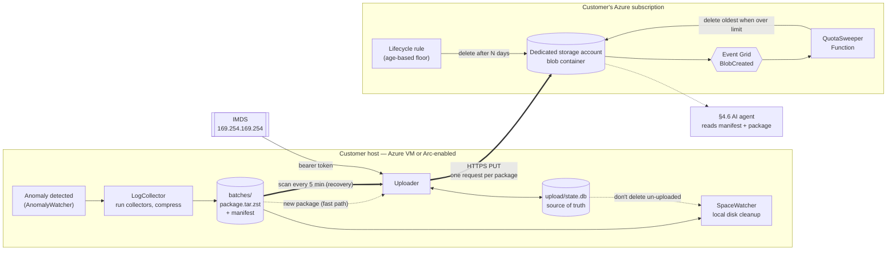
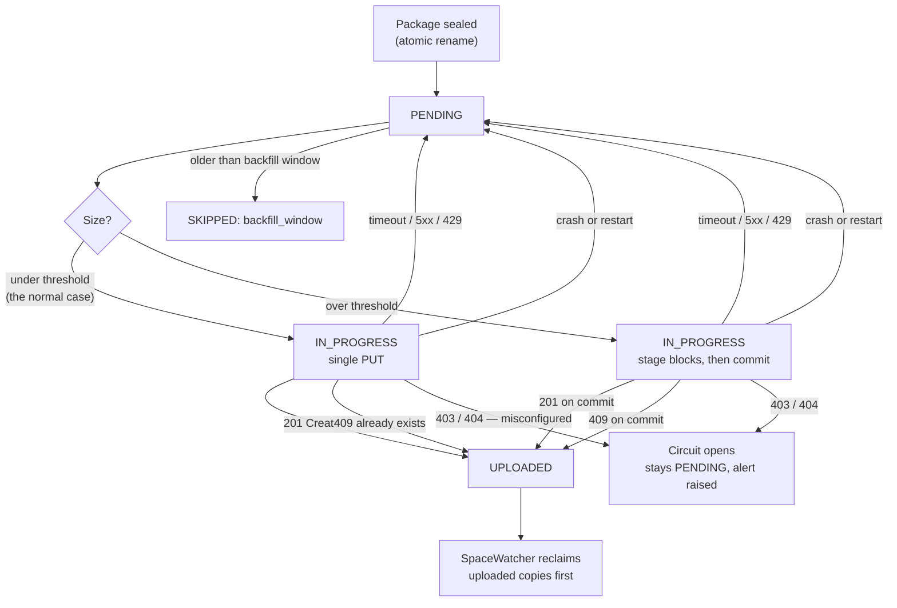

# AODv2 Auto-Upload — Decision Record

Scope: §4.5 of the Azure Files Linux Diagnostic Ecosystem proposal.
**Not in v1: AKS** (Azure VMs and Arc-enabled machines only).

**What this feature does:** when AODv2 captures a diagnostic package, upload it to a storage
account in the customer's own subscription.

**Boundary:** AODv2 uploads. It never deletes cloud data, never creates cloud resources, and
never knows the quota. The cloud side handles retention.

---

## How It Works



**What happens to a single package:**



---


## Measured baseline

A real package on a CIFS-mounted host: **21 KB uncompressed, ~5 KB compressed (zstd-3)**.
`dmesg` was empty here (non-root); budget ≤500 KB for it. **Realistic package: under 1 MB.**

At 100 hosts × 10 packages/day × 30 days that is ≈150 MB total. This number matters for D5.

---

# Decisions

## D1 — Destination storage account ✅

**Why we must decide.** The config needs an account name. The obvious answer — "the same
account as the Azure Files share we're diagnosing" — does not work: a package contains
`dmesg`, `mounts`, `DebugData` for the **whole host**, so a machine mounting three accounts
produces one package belonging to all three. There is no "the" account. Worse, premium Azure
Files uses account kind `FileStorage`, which **has no blob service at all**, so uploads would
fail outright for a large share of customers.

**The question.** Same account as the monitored share, a dedicated diagnostics account, or
one central account for the whole fleet?

**Decision: a dedicated GPv2 account, blob container, same region, created by the customer's
setup script.** Multiple hosts share it, separated by prefix.

**Why not the others.**

- *Same account as the share* — undefined (above), plus upload would compete for the same
  account throughput as the workload, perturbing the incident being measured.
- *Fleet-central* — cross-region egress and data-residency problems; one compromised client
  could read the whole fleet's evidence.
- *Azure Files instead of blob* — Files has the only real hard quota, which is why this was
  contested. But it has no lifecycle management, no atomic publish, and **Event Grid does not
  fire for SMB/NFS writes**, which would break D2's trigger.

---

## D2 — What deletes old data in the cloud ✅

**Why we must decide.** AODv2 uploads indefinitely. If nothing deletes, the container grows
forever and so does the customer's bill. This cannot be left to the platform: **Azure Blob has
no container size limit and emits no "container full" event.** Lifecycle Management rules fire
only on *age*, never on size — "delete when over X GB" is not expressible.

**The question.** Who measures usage and deletes — AODv2, or something in the cloud?

**Decision: a customer-owned Azure Function, triggered by Event Grid `BlobCreated`.** AODv2
does nothing.

```
BlobCreated ──► Function: counter += size          (cheap, no listing)
                  └─► if counter > 90%:
                        list container → true size
                        → delete oldest until 70%
                        → reset counter to measured truth
```

Backed by an LCM age rule (e.g. 30 days) as a free floor, and optionally a daily timer to
catch dropped events.

**Why not the alternatives.**

- *AODv2 deletes* — every client would need delete rights on a **shared** container, so one
  compromised client could destroy other hosts' evidence. Offline or decommissioned clients
  would orphan their data forever.
- *LCM alone* — free and zero-maintenance, but age-only, so a burst can blow past the budget.
  Kept as a backstop, not the mechanism.
- *Timer-driven sweeper* — reacts up to an hour late. Event-driven is strictly better.

**On the counter drifting:** Event Grid is at-least-once and unordered, so the count is
approximate. That is fine here — drift is only ever *upward*, and every threshold crossing
does a real listing that resets the counter to truth. A duplicate event causes one harmless
early sweep.

**Cost:** within the Functions Consumption free grant (1M executions/month). Effectively $0.

---

## D3 — What happens when the container is full of recent data ✅

**Why we must decide.** The sweeper deletes oldest-first. A minimum-age guard ("never delete
anything under N hours old") would protect a live incident's evidence — but it can deadlock,
because during a fleet-wide incident *everything* is under N hours old and the sweeper can
free nothing.

**The question.** Add a minimum-age guard and define deadlock behaviour, or no guard at all?

**Decision: no minimum-age guard.** The sweeper always deletes oldest-first once over the
limit. There is no deadlock case to handle, and nothing extra to configure.

**Why this is acceptable.** The quota is configurable by the customer's setup script, and
packages measure ~5 KB — the container realistically never fills. If it ever does, the
customer raises the limit.

**Accepted risk, stated plainly:** during a large burst the sweeper may delete early packages
from the *same* incident it is capturing. There is no protection against this in v1 — no
guard, and no host prioritisation (see dropped D10).

---

## D4 — Authentication method ✅

**Why we must decide.** **Azure Storage rejects unauthenticated writes with 401.** Anonymous
write to blob does not exist — public access is read-only and off by default. So every upload
must carry a credential; the only question is where it comes from. Choose wrong and either a
long-lived secret sits on every customer host, or setup needs permissions the customer's admin
won't grant.

Note: the diagnostics container is **not mounted** — AODv2 uploads over HTTPS REST. (The Azure
Files share being *diagnosed* is mounted, but that is a different account and protocol.)
Mounting it with blobfuse was considered and rejected: it still needs credentials, and **a
hung mount can wedge processes in uninterruptible `D` state** — unacceptable for a tool whose
job is to watch network storage misbehave.

**The question.** Managed identity, SAS token, or shared key?

| | **A — Managed identity** (recommended) | **B — SAS token** | **C — Shared key** |
|---|---|---|---|
| **On the host** | Nothing — token fetched at runtime from a local endpoint | Long-lived secret in `config.yaml` | Account key in `config.yaml` |
| **Pro** | No secret anywhere on disk | Works on any host, including non-Azure | Trivial setup |
| **Pro** | Auto-rotated; revoke by removing the role assignment | No Azure-specific dependency | — |
| **Pro** | Can grant write-without-delete, scoped to the container | Can scope permissions | — |
| **Con** | Azure VM or Arc only | **Secret on disk** — contradicts §4.3 of the proposal | Account-wide credential that can do anything |
| **Con** | **Setup needs Owner / User Access Administrator** to create the role assignment | Expiry + rotation + fleet-wide redistribution | Cannot express write-without-delete |
| **Verdict** | Recommended | Escape hatch, documented | Disqualified |

**Decision: A** — managed identity on Azure VMs, Arc-enabled managed identity off-Azure.
Grant **write without delete**, scoped to the container.

**What it looks like at runtime:** the SDK's `ManagedIdentityCredential` (D7) fetches a token
from `169.254.169.254` — an address reachable only from inside that VM — caches it, and
refreshes before expiry. Underneath it is a single HTTP GET; the credential object is passed
once to the blob client, so this is a few lines rather than a token-handling implementation.

**Consequence to plan for:** setup requires the customer's Azure admin, because creating the
role assignment needs Owner or User Access Administrator. The setup script must be written
for that audience, and the docs must say so up front — it is the most likely onboarding
friction point.

---

## D5 — Package size cap ✅

**Why we must decide.** Azure Blob can accept a blob in a single request up to a limit. If we
guarantee every package stays under it, upload is **one HTTP PUT (~20 lines)**. If packages can
exceed it, we must implement block staging, block-ID tracking, resume-after-failure, and
cleanup of orphaned blocks — several hundred lines and a class of bugs where partially-staged
blocks consume billing but are invisible to the sweeper's listing.

So this is not really "what number" — it is **"do we write the multipart upload path at all?"**

**The question.** Cap package size and reject oversized packages, or support unlimited size
with multipart upload?

| | **A — Cap at 64 MiB** (recommended) | **B — No cap, multipart upload** |
|---|---|---|
| **Code** | One PUT. ~20 lines | Block staging, resume, orphan cleanup |
| **Atomicity** | Free — a PUT lands whole or not at all | Must commit a block list |
| **Retry safety** | Free — `If-None-Match` gives 409 if already uploaded, so retries are safe after a crash | Must reconcile staged blocks |
| **Sweeper accuracy** | Exact | Uncommitted blocks bill but are invisible to listing |
| **Oversized package** | **Not uploaded** — flagged, kept on local disk | Always uploaded |
| **Failed upload** | Restarts from zero (bounded by the cap) | Resumes |

**Decision: B — no size cap. Every package uploads, however large.**

**How it is built — hybrid, not multipart-only.** A 5 KB package must not pay for block
staging, so the uploader picks a path by size:

| Package size | Path | API calls |
|---|---|---|
| Under `multipart_threshold_mb` (default 64) — **essentially always** | single `Put Blob` | 1 |
| Over the threshold — rare | `Put Block` × N, then `Put Block List` | N + 1 |

This keeps the simple path for the measured reality (~5 KB) and adds the large path for
correctness, so nothing is ever rejected. Config gains `multipart_threshold_mb` and
`block_size_mb` (default 4); `max_package_size_mb` is gone.

**We do not implement this by hand.** Per D7 the Azure SDK's `upload_blob()` already performs
exactly this switch via `max_single_put_size` / `max_block_size`, including per-block retry.
The two config values above map straight onto those parameters.

**Idempotency is preserved on both paths.** `If-None-Match: *` goes on the single `Put Blob`
and on `Put Block List` — the commit is the atomic step, so a 409 on either means a previous
attempt already succeeded. Retry after a crash stays safe.

**Resume needs no extra state.** Block IDs are derived from the chunk index, so they are
deterministic, and `Put Block` is idempotent for a given ID. After a crash the uploader
simply re-stages from the beginning — already-staged blocks are overwritten harmlessly. **No
new columns in the SQLite store**, which was the main complexity worry.

**Accepted cost — the sweeper can under-measure.** Blocks staged but never committed consume
billed capacity yet are **invisible to `List Blobs`**, so D2's size calculation can read low.
Azure garbage-collects uncommitted blocks after 7 days, which bounds the leak. Given the
large path should almost never execute, this is accepted rather than engineered around. If it
ever matters, the sweeper can call `Get Block List` on suspect blobs.

**No `SKIPPED/oversize` state.** That reason code is removed; the only remaining skip reason
is `backfill_window`.

---

## D6 — Blob path layout ✅

**Why we must decide.** The path is a contract for three consumers at once: Lifecycle
Management can filter **only on prefix**; the sweeper must find "oldest"; and support needs
"everything from host X" during a case. And with no version in the path, the format can never
change without breaking every reader.

**The question.** Host first or date first?

**Decision: host, then date, then file.**

```
aodv2/v1/<host-id>/<YYYY-MM-DD>/<HHMMSS>Z-<anomaly>.tar.zst
aodv2/v1/<host-id>/<YYYY-MM-DD>/<HHMMSS>Z-<anomaly>.manifest.json
```

**Why not date first.** It looks like it would help the sweeper find the oldest blobs
cheaply, but the sweeper has to list the whole container to measure size anyway — so ordering
is a free in-memory sort either way. And **LCM age rules read blob properties, not the path**,
so a date prefix buys nothing for retention. Host-first makes per-host retrieval a single
prefix listing, which is what support actually asks for.

**Manifest** is written both as a sibling blob (so the §4.6 AI agent can read metadata without
downloading the archive) and inside the tar (so the archive stays self-describing). It records
schema version, AODv2 version, host, anomaly type, environment, **which collectors succeeded
and which failed**, size, and checksum.

---

## D7 — Azure SDK vs raw REST ✅ *(revised — was raw REST)*

**Why we must decide.** Whatever we import ships to every customer's production host, runs as
**root**, and must be packaged as DEB and RPM for every supported distro.

**The question.** Use `azure-storage-blob` + `azure-identity`, or call the REST API directly?

**Decision: use the Azure SDK.** Transport still sits behind an interface, so raw REST
remains possible later.

**This reverses an earlier decision.** The original argument was "raw REST, zero new
dependencies" — justified by D5's size cap making the API surface two calls, and by a claim
that the SDK's compiled wheels would force an architecture × glibc packaging matrix. Both
halves broke:

**1. D5 chose multipart, so the SDK now does real work.** `upload_blob()` already implements
exactly the hybrid design in D5 — single `Put Blob` under `max_single_put_size`, automatic
block staging and commit above it, with per-block retry. That is the 150–250 lines we would
otherwise write and test ourselves. It also handles token acquisition, caching and refresh.

**2. The dependency objection did not survive measurement.**

| | Wheels | Size | Compiled |
|---|---|---|---|
| AODv2 already ships | 6 | **33 MB** | numpy, pandas, pyyaml, zstandard |
| Azure SDK adds | 16 | **6.6 MB** | cffi, charset_normalizer, cryptography |

The SDK is roughly **5× smaller than the existing dependency set** and introduces no new
*class* of problem — four compiled, per-architecture wheels are already shipped. And
`cryptography` publishes **manylinux2014 (glibc 2.17+)** wheels for x86_64 and aarch64, which
covers RHEL 8, Ubuntu 20.04 and SLES 15. The "glibc matrix" concern was unfounded.

**What the SDK does *not* fix** — identical either way, because these are service-level
facts:

- Uncommitted blocks bill but are invisible to `List Blobs`, so D2's sweeper under-measures.
- No resume across a process restart. The SDK retries within a call but does not persist
  block state to disk.

**The one real remaining cost:** `azure-*` packages are not in Debian or RHEL repositories,
while `python3-numpy` and `python3-yaml` are. So the SDK forces vendoring (or a bundled
virtualenv) rather than distro dependencies. That is a packaging-strategy decision which is
**not yet made** — and the DEB/RPM recipes do not declare them.

**Revisit if** the team commits to distro-packaged dependencies only. In that case raw REST
becomes preferable again, and the transport interface makes the switch contained.

**Security note:** 16 additional packages run inside a root process. Pin versions, and track
them in whatever vulnerability-scanning process covers the existing dependencies.

---

## D8 — Redaction ❌ Not in v1

**Decision: no redaction layer.** Packages are uploaded as collected. Rationale: AODv2 does
not deliberately capture credentials, and the destination is the customer's own storage
account.

**Residual risk — recorded so it is a known, accepted position rather than an oversight.**
The risk is not that AODv2 collects passwords; it is that two collectors capture *other
applications'* logs wholesale:

```python
# JournalctlQuickAction — no unit filter
["journalctl", "--since", f"{interval} seconds ago"]
# SysLogsQuickAction — the whole system log
["tail", "-n100", "/var/log/syslog"]
```

Neither is scoped to SMB or the kernel, so whatever any process on the box logged in that
window is included. If a third-party application logs a token or connection string, it ends
up in the package — and then in blob storage, and potentially in front of the §4.6 AI agent
or a support engineer. AODv2 cannot know what other software chooses to log.

**Two items worth doing anyway, independent of redaction:**

1. **Scope the journal collector to relevant units** (`-k`, kernel + mount helpers). This is
   a collector-quality fix as much as a privacy one — it also makes packages smaller and the
   evidence easier to read. Cheap, and it removes most of the risk above without any
   redaction machinery.
2. **Fix portability:** `/var/log/syslog` is Debian-only; RHEL and SLES use
   `/var/log/messages`. Today the collector silently produces nothing on those distros.

**Still likely required:** a documented list of what the package contains, for privacy
review. Dropping redaction removes the *filtering* work, not the *data-classification*
obligation in §5 of the proposal.

---

## D9 — Upload trigger and state ✅

**Why we must decide.** Existing components hand work to each other through in-memory
`queue.Queue`. If upload copies that pattern, **every pending upload is lost on restart or
crash** — and packages collected while upload was disabled would never be seen at all.

**The question.** Event queue, directory scan, or both — and what is the authoritative record?

**Decision: both. A SQLite store on disk is the source of truth; the queue is only a speed
optimisation.**

| Situation | Queue alone | Scan alone | Both |
|---|---|---|---|
| Normal upload | instant | up to 5 min late | instant |
| Service restarts with 12 pending | **lost** | recovered | recovered |
| Upload enabled after being off | **never seen** | recovered | recovered |
| Retry due after network outage | **lost** | recovered | recovered |

Losing the queue costs one scan interval. Losing the state store loses data — hence SQLite,
not Python objects.

**Backfill:** the first scan after enabling finds *every* package ever collected — potentially
hundreds. `backfill_max_age_hours` (default 24) uploads only recent ones. Not zero, because
people usually enable upload right after something breaks.

---

## D10 — Host prioritisation during an incident ❌ Dropped

**Not doing this in v1.** The sweeper deletes oldest-first with no notion of importance, and
nothing overrides that.

**What was considered and rejected:** a `PROTECTED_HOSTS` setting on the sweeper so a host
under active investigation would be evicted last. Dropped as unnecessary complexity — at
~5 KB per package with a customer-configurable quota, the container is unlikely to reach the
point where eviction order matters.

**Accepted consequence:** if the container ever does fill, a busy unrelated host can evict the
packages of the machine being investigated. Combined with D3 (no minimum-age guard), there is
no mechanism in v1 that protects any package from eviction. Revisit if a customer hits it.

**Also dropped with it: D10a**, the question of how incident protection would expire. With no
protection mechanism there is nothing to expire.

---

# Constraints

Not decisions — facts that must not be forgotten during implementation.

**Storage features that silently break the sweeper.** The Bicep template must disable soft
delete on the container, avoid tiering, and not enable immutability.

| Feature | What breaks |
|---|---|
| Soft delete / versioning | Deleted data still bills, so the sweeper deletes more and frees nothing |
| Immutability policy | Deletes fail until retention expires — sweeper silently disabled |
| Tiering (cool/cold/archive) | 30/90/180-day minimums mean early deletion *raises* cost |

**"Write without delete" is not tamper-proof.** The `blobs/write` permission allows
*overwriting* an existing blob. A compromised client still cannot delete, but it can destroy
another host's evidence by overwriting it. Fixing this properly needs a per-host ABAC
condition, which does not scale to a fleet. Accepted for v1 — D1 limits the blast radius to
traces only.

**Upload failure must never stop collection.** A broken upload path sets an explicit state and
alerts. It must never disable monitoring or diagnostics.

**Packages are host-scoped, not share-scoped.** One package covers all mounts, so it cannot be
attributed to an account or share. Any future prioritisation or filtering could only ever work
per *host*. Per-share attribution would need a tree-connect id added to the eBPF event struct
(a request for the collector owner). Not relevant in v1, since prioritisation was dropped.

**`host_id` needs privacy review.** Implemented as a salted hash of `/etc/machine-id`
(`src/utils/host_id.py`), falling back to `/var/lib/dbus/machine-id` and then the hostname.
The raw machine-id is never exported. Changing the format touches only that module.

---

# Open Questions

**For other owners:**

1. `host_id` format — privacy review of the salted machine-id hash now implemented.
2. Documented list of what a package contains — privacy review may still require this even
   though redaction was dropped (D8).
3. Tree-connect id in the eBPF event struct — collector owner. Not needed for v1.

No open engineering decisions remain.
